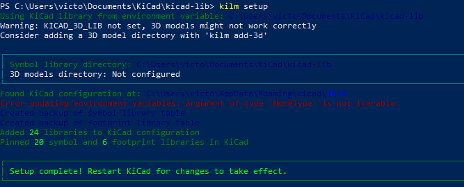
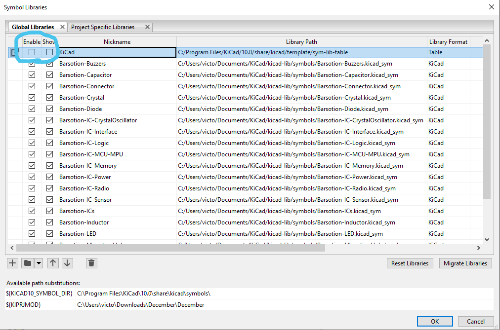
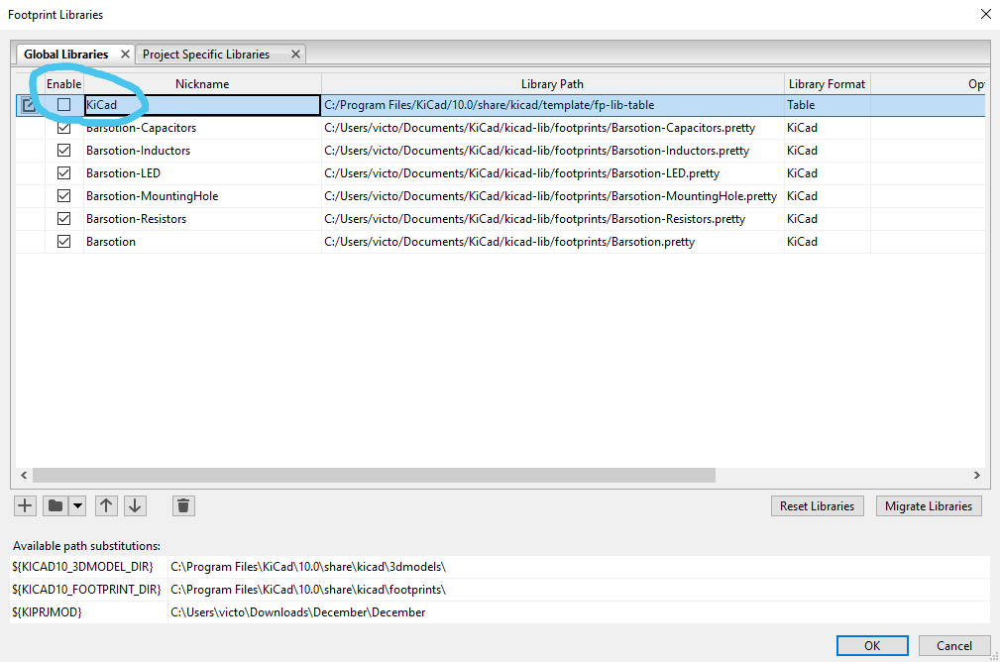
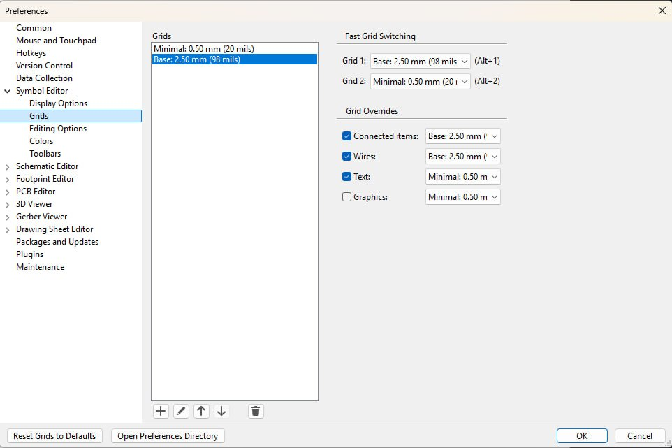
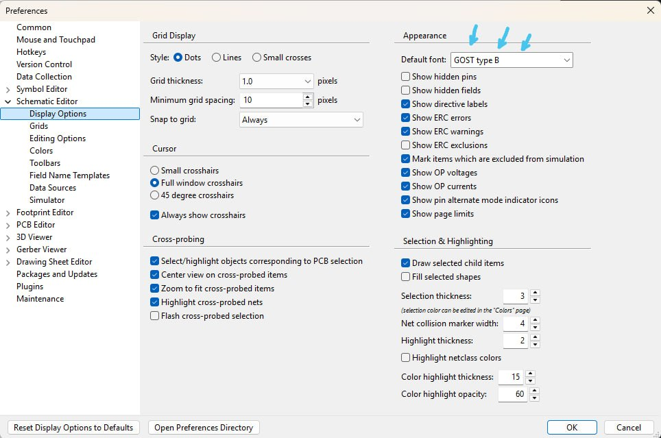
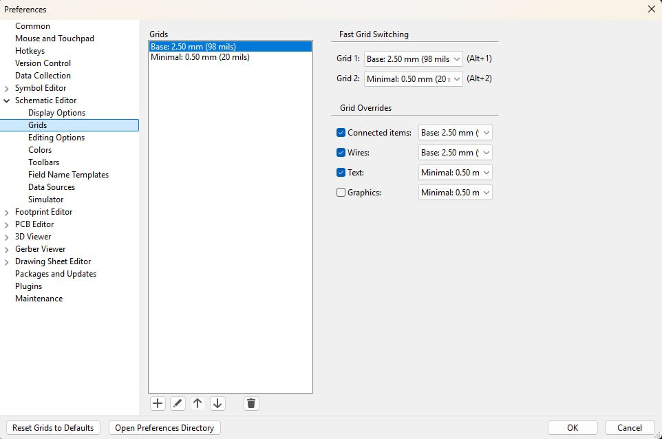
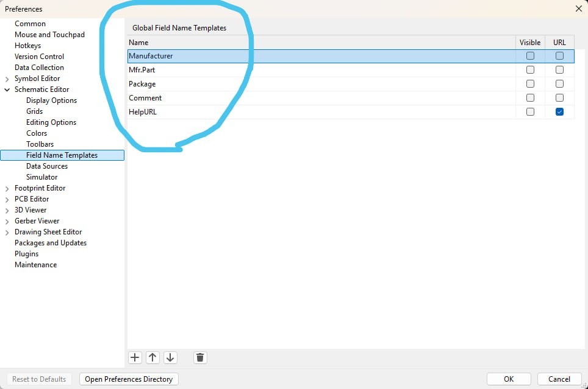
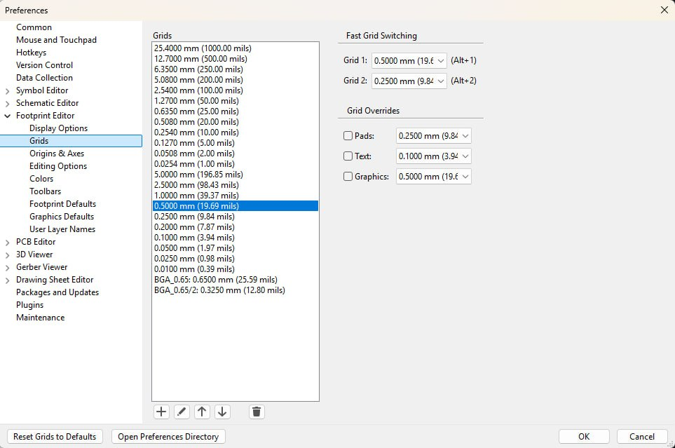
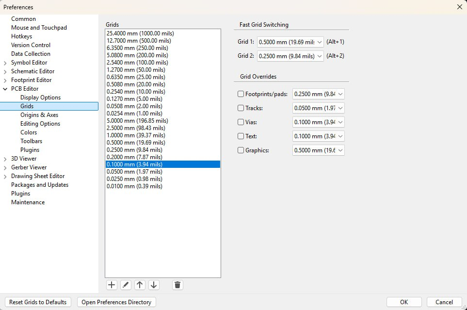

# KiCad preparing for work (rev 1.1)

## 1. Obtain Barsotion KiCad libraries

```
git clone git@github.com:Barsotion/kicad-lib.git
kilm setup
```

For updating from server:

```
git pull
kilm setup
```

Be shore there are no critical errors:



## Turn off standard KiCad libraries pack

On the main KiCad menu, Preferences -> Manage Symbol Libraries...:



On the main KiCad menu, Preferences -> Manage Footprint Libraries...:



On the main KiCad menu, Preferences -> Preferences...:




You should to install a [GOST type B](./gost_type_b.ttf) font.











Then, your KiCad is ready to work.
